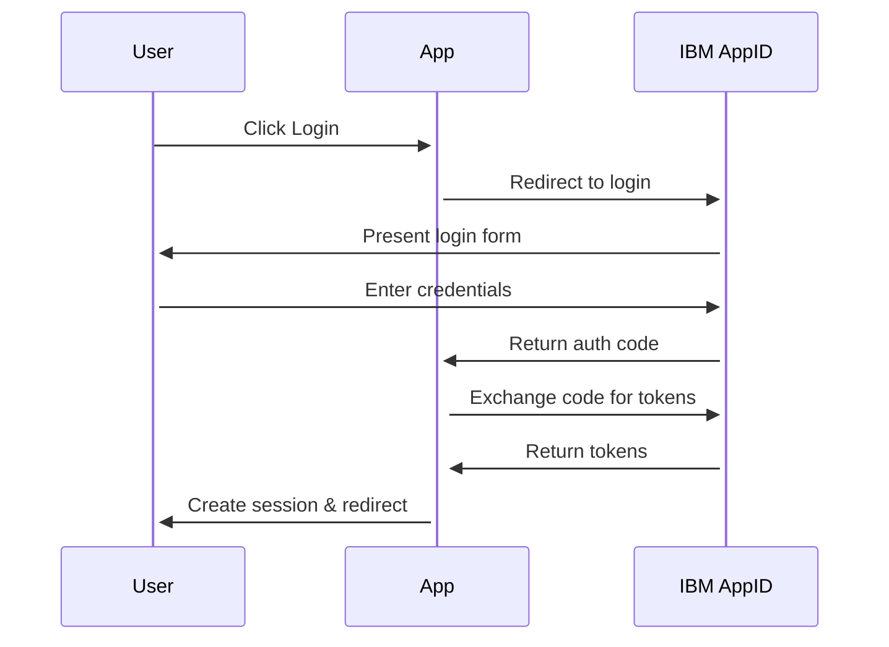
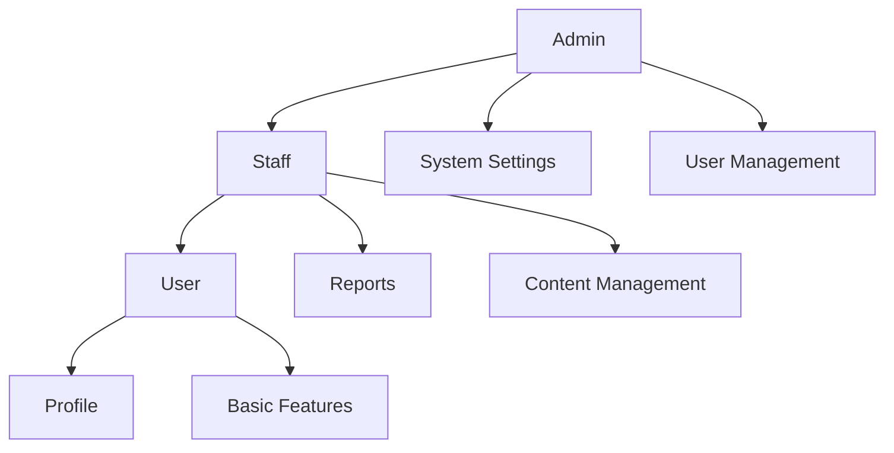

# YorkU Secure App - IBM App ID Integration

Please [Download the Workshop PDF](./workshop.pdf) and see below

## Introduction

This Next.js application demonstrates enterprise-level authentication and authorization using IBM App ID and OpenID Connect (OIDC). Built with security and scalability in mind, it provides a robust foundation for secure web applications.

### Key Features

- **Modern Stack**: Built with Next.js 14, React, and TypeScript
- **Enterprise Authentication**: IBM App ID integration with OIDC/OAuth 2.1
- **Role-Based Security**: Granular access control with multiple user roles
- **Responsive Design**: Bootstrap 5 for mobile-first interface
- **Real-time Validation**: Client and server-side security checks
- **Audit Logging**: Comprehensive activity tracking
- **User Management**: Complete user lifecycle management

### Technical Stack

- **Frontend**: Next.js, React 18, TypeScript
- **Styling**: Bootstrap 5, Custom CSS
- **Authentication**: IBM App ID, NextAuth.js
- **State Management**: React Hooks, Context API
- **API Integration**: Axios, REST APIs
- **Security**: JWT, CSRF Protection, HTTP-only Cookies

## 🔐 Authentication & Authorization

### IBM App ID Integration

The application leverages IBM App ID's enterprise-grade identity services:

#### Features
- **Single Sign-On (SSO)**
  - Seamless authentication across multiple applications
  - Support for multiple identity providers
  - Centralized user management
  
- **Token-based Authentication**
  - JWT tokens for secure authentication
  - Automatic token refresh mechanism
  - Token validation and verification
  
- **Role-based Access Control**
  - Dynamic role assignment
  - Hierarchical permission structure
  - Fine-grained access control
  
- **User Profile Management**
  - Custom user attributes
  - Profile updates and verification
  - Identity provider linking
  
- **Secure Session Handling**
  - HTTP-only cookie storage
  - CSRF protection
  - Session timeout management

### Authentication Flow

#### 1. Initial Authentication


**Detailed Steps:**
1. User initiates login process
   - Clicks "Login with IBM App ID" button
   - Application prepares authentication request
   - Generates and stores state parameter

2. IBM App ID Authentication
   - Secure redirect to IBM App ID login page
   - User enters credentials
   - Multi-factor authentication (if enabled)
   - Consent screen (for first-time users)

3. Token Exchange
   - Receive authorization code
   - Backend exchanges code for tokens
   - Validate token signatures
   - Extract user information

4. Session Creation
   - Create secure session
   - Store tokens securely
   - Set up refresh token mechanism
   - Redirect to appropriate page

#### 2. Session Management

The application uses NextAuth.js for robust session management:

**Session Features:**
- Secure token storage in HTTP-only cookies
- Automatic token refresh before expiration
- Session state synchronization
- Secure session termination

**Implementation:**
```typescript
// Session configuration
export const authOptions: NextAuthOptions = {
  providers: [
    AppIDProvider({
      clientId: process.env.APP_ID_CLIENT_ID!,
      clientSecret: process.env.APP_ID_CLIENT_SECRET!,
      issuer: process.env.APP_ID_ISSUER,
    }),
  ],
  callbacks: {
    async session({ session, token }) {
      // Enhance session with user roles and permissions
      session.user.roles = token.roles;
      session.user.permissions = token.permissions;
      return session;
    },
    async jwt({ token, account, profile }) {
      // Add custom claims to JWT
      if (account && profile) {
        token.roles = profile.roles;
        token.permissions = profile.permissions;
      }
      return token;
    },
  },
  // Additional security configurations
  session: {
    strategy: "jwt",
    maxAge: 30 * 24 * 60 * 60, // 30 days
  },
  cookies: {
    sessionToken: {
      name: "__Secure-next-auth.session-token",
      options: {
        httpOnly: true,
        sameSite: "lax",
        path: "/",
        secure: true,
      },
    },
  },
};
```

#### 3. Protected Routes

The application implements multiple layers of route protection:

**Client-side Protection:**
```typescript
// Using useSession hook
export default function ProtectedComponent() {
  const { data: session, status } = useSession({
    required: true,
    onUnauthenticated() {
      // Redirect to login
    },
  });

  if (status === "loading") {
    return <LoadingSpinner />;
  }

  return <div>Protected Content</div>;
}
```

**Server-side Protection:**
```typescript
// API route protection
export default async function handler(req: NextApiRequest, res: NextApiResponse) {
  const session = await getSession({ req });
  
  if (!session) {
    return res.status(401).json({ error: "Unauthorized" });
  }

  // Check for specific roles
  if (!session.user?.roles?.includes("admin")) {
    return res.status(403).json({ error: "Insufficient permissions" });
  }

  // Handle authorized request
}
```

**Middleware Protection:**
```typescript
// Global middleware for route protection
export function middleware(req: NextRequest) {
  const token = req.cookies.get("__Secure-next-auth.session-token");
  
  if (!token && !req.nextUrl.pathname.startsWith("/auth")) {
    return NextResponse.redirect(new URL("/auth/signin", req.url));
  }
  
  return NextResponse.next();
}
```

### Security Best Practices

1. **Token Security**
   - Short-lived access tokens
   - Secure token storage
   - Regular token rotation
   - Token scope validation

2. **Request Security**
   - CSRF tokens for state management
   - Rate limiting on auth endpoints
   - Input validation and sanitization
   - Secure headers configuration

3. **Error Handling**
   - Secure error messages
   - Audit logging of auth failures
   - Rate limiting of failed attempts
   - Secure session termination

## 🛡️ Role-Based Access Control (RBAC)

### Role Architecture

The application implements a hierarchical role-based access control system that provides fine-grained permissions management:

#### 1. Role Hierarchy



#### 2. Role Definitions

**Admin Role (`admin`)**
- **Access Level**: Full system access
- **Capabilities**:
  - User Management
    - Create/Delete users
    - Assign roles
    - Reset passwords
  - Role Management
    - Define roles
    - Assign permissions
    - Configure role hierarchy
  - System Settings
    - Configure application settings
    - Manage security parameters
    - Set up integrations
  - Audit Logs
    - View all system logs
    - Track user activities
    - Generate audit reports

**Staff Role (`staff`)**
- **Access Level**: Elevated access
- **Capabilities**:
  - User Information
    - View user profiles
    - Update user details
    - Handle user requests
  - Content Management
    - Create/Edit content
    - Manage resources
    - Handle user submissions
  - Reporting
    - Generate reports
    - View statistics
    - Export data

**User Role (`user`)**
- **Access Level**: Basic access
- **Capabilities**:
  - Profile Management
    - Update personal info
    - Change password
    - Manage preferences
  - Basic Features
    - Access standard features
    - View public content
    - Submit requests

### Technical Implementation

#### 1. Role Checking

```typescript
// Role utility functions
export const roleUtils = {
  isAdmin: (session?: Session | null): boolean => {
    return session?.user?.roles?.some(role => role.name === "admin") ?? false;
  },

  isStaff: (session?: Session | null): boolean => {
    return session?.user?.roles?.some(role => role.name === "staff") ?? false;
  },

  hasPermission: (session: Session | null, permission: string): boolean => {
    return session?.user?.permissions?.includes(permission) ?? false;
  },

  requireRole: (role: string) => {
    return (req: NextApiRequest, res: NextApiResponse, next: NextFunction) => {
      const session = getSession({ req });
      if (!session?.user?.roles?.some(r => r.name === role)) {
        return res.status(403).json({ error: "Insufficient permissions" });
      }
      return next();
    };
  }
};
```

#### 2. Component-Level Protection

```typescript
// Protected component with role check
export function AdminOnlyComponent({ children }: { children: React.ReactNode }) {
  const { data: session, status } = useSession();
  const isAdmin = session?.user?.roles?.some(role => role.name === "admin");

  if (status === "loading") {
    return <LoadingSpinner />;
  }

  if (!isAdmin) {
    return <UnauthorizedMessage />;
  }

  return <>{children}</>;
}
```

#### 3. Route Protection

```typescript
// API route with role protection
export default async function adminHandler(req: NextApiRequest, res: NextApiResponse) {
  const session = await getSession({ req });

  // Check authentication
  if (!session) {
    return res.status(401).json({ error: "Not authenticated" });
  }

  // Check admin role
  if (!roleUtils.isAdmin(session)) {
    return res.status(403).json({ error: "Admin access required" });
  }

  // Handle admin-only functionality
  switch (req.method) {
    case "GET":
      return handleAdminGet(req, res);
    case "POST":
      return handleAdminPost(req, res);
    default:
      res.setHeader("Allow", ["GET", "POST"]);
      return res.status(405).json({ error: `Method ${req.method} not allowed` });
  }
}
```

### Role Management Interface

The application provides a comprehensive role management interface for administrators:

#### 1. Role List View
- Display all available roles
- Show role hierarchy
- Indicate number of users per role
- Quick actions for each role

#### 2. Role Editor
- Edit role properties
- Manage role permissions
- Configure role relationships
- Set role constraints

#### 3. User-Role Assignment
- Assign roles to users
- Bulk role management
- Role assignment history
- Temporary role assignments

### Role Synchronization

The application maintains role synchronization with IBM App ID:

#### 1. Initial Role Fetch
```typescript
async function fetchUserRoles(userId: string, accessToken: string): Promise<string[]> {
  try {
    const response = await axios.get(
      `${process.env.APP_ID_MANAGEMENT_URL}/users/${userId}/roles`,
      {
        headers: {
          Authorization: `Bearer ${accessToken}`,
        },
      }
    );
    return response.data.roles || [];
  } catch (error) {
    console.error("Error fetching roles:", error);
    return [];
  }
}
```

#### 2. Role Updates
```typescript
async function updateUserRoles(userId: string, roles: string[]): Promise<boolean> {
  try {
    await axios.put(
      `${process.env.APP_ID_MANAGEMENT_URL}/users/${userId}/roles`,
      { roles },
      {
        headers: {
          Authorization: `Bearer ${getManagementToken()}`,
        },
      }
    );
    return true;
  } catch (error) {
    console.error("Error updating roles:", error);
    return false;
  }
}
```

### Best Practices

1. **Role Assignment**
   - Follow principle of least privilege
   - Regular role audit and review
   - Document role changes
   - Implement role expiration

2. **Permission Management**
   - Granular permission definitions
   - Regular permission review
   - Permission inheritance rules
   - Permission conflict resolution

3. **Security Considerations**
   - Role-based session management
   - Role change auditing
   - Secure role storage
   - Role validation checks

4. **Performance Optimization**
   - Cache role assignments
   - Optimize role checks
   - Batch role updates
   - Efficient role queries

## 📄 Protected Pages

### Admin Pages
- `/admin` - Admin dashboard
- `/admin/users` - User management
- `/admin/roles` - Role management
- `/admin/audit` - Audit logs

### Staff Pages
- `/staff` - Staff dashboard
- `/reports` - Report generation

### User Pages
- `/profile` - User profile
- `/activity-log` - User activity
- `/userinfo` - OIDC user information
- `/protected` - Example protected page

## 🔑 OIDC Implementation

### Configuration

The OIDC configuration is managed through environment variables:

```env
APP_ID_ISSUER=https://your-tenant.appid.cloud.ibm.com/oauth/v4/{tenant-id}
APP_ID_CLIENT_ID=your-client-id
APP_ID_CLIENT_SECRET=your-client-secret
```

### Token Handling

1. **ID Token**
   - Contains user identity information
   - Verified using JWKS
   - Used for user profile data

2. **Access Token**
   - Used for API authorization
   - Sent in Authorization header
   - Verified on protected endpoints

### User Information

The application fetches user information from multiple endpoints:

```typescript
// Fetching user info from OIDC endpoint
const userInfoEndpoint = `${process.env.APP_ID_ISSUER}/userinfo`;
const response = await axios.get(userInfoEndpoint, {
  headers: {
    Authorization: `Bearer ${session.accessToken}`,
  },
});
```

## 🔒 Security Features

1. **Token Validation**
   - JWT signature verification
   - Expiration checking
   - Audience validation
   - Issuer validation

2. **Session Security**
   - HTTP-only cookies
   - Secure cookie flags
   - CSRF protection
   - XSS prevention

3. **Error Handling**
   - Graceful error recovery
   - User-friendly error messages
   - Secure error logging

## 📚 API Endpoints

### Authentication Endpoints
- `/api/auth/[...nextauth]` - NextAuth.js authentication handling
- `/api/auth/session` - Session information

### Protected API Routes
- `/api/user` - User information
- `/api/admin/*` - Admin-only endpoints
- `/api/staff/*` - Staff-only endpoints

## 🚀 Getting Started

1. **Set up IBM App ID**
   - Create an IBM Cloud account
   - Set up App ID service
   - Configure application credentials
   - Set up roles and permissions

2. **Environment Configuration**
   ```env
   # Authentication
   APP_ID_ISSUER=your-issuer-url
   APP_ID_CLIENT_ID=your-client-id
   APP_ID_CLIENT_SECRET=your-client-secret
   
   # NextAuth.js
   NEXTAUTH_URL=http://localhost:3000
   NEXTAUTH_SECRET=your-secret
   
   # Additional Configuration
   APP_ID_TENANT_ID=your-tenant-id
   APP_ID_PROFILES_URL=your-profiles-url
   ```

3. **Run the Application**
   ```bash
   npm install
   npm run dev
   ```

## 🔍 Testing Authentication

1. **User Login**
   - Visit the home page
   - Click "Login with IBM App ID"
   - Enter credentials
   - Verify successful redirect

2. **Role Testing**
   - Login as admin user
   - Verify admin dashboard access
   - Login as staff user
   - Verify staff-only features
   - Login as regular user
   - Verify appropriate restrictions

## 📖 Additional Resources

- [IETF RFC6749 - OAuth 2.0](https://datatracker.ietf.org/doc/html/rfc6749)
- [IETF RFC7636 - PKCE](https://datatracker.ietf.org/doc/html/rfc7636)
- [IETF DRAFT-OAuth-v2.1](https://www.ietf.org/archive/id/draft-ietf-oauth-v2-1-12.txt)
- [OpenID Connect Specification](https://openid.net/connect/)
- [OIDC Guides](https://openid.net/developers/how-connect-works)
- [IBM App ID Documentation](https://cloud.ibm.com/docs/appid)
- [Next.js Documentation](https://nextjs.org/docs)
- [NextAuth.js Documentation](https://next-auth.js.org)


## 🔐 IBM App ID Configuration Details

### OIDC Configuration

The application uses IBM App ID as the OpenID Connect provider with the following configuration:

```json
{
  "clientId": "cb47761b-728f-45b4-9937-d5ae9747bfa9",
  "tenantId": "f84ea474-f78c-4708-9f9d-d1f0bb83b521",
  "name": "YorkUSecurityAppID01",
  "oAuthServerUrl": "https://us-south.appid.cloud.ibm.com/oauth/v4/f84ea474-f78c-4708-9f9d-d1f0bb83b521",
  "profilesUrl": "https://us-south.appid.cloud.ibm.com",
  "discoveryEndpoint": "https://us-south.appid.cloud.ibm.com/oauth/v4/f84ea474-f78c-4708-9f9d-d1f0bb83b521/.well-known/openid-configuration"
}
```

### Scopes and Permissions

The application requests the following scopes:
- `profile`: Basic user profile information
- `staff`: Staff member access
- `admin`: Administrative access

### User Profile Structure

The user profile contains rich information from IBM App ID. Here's an example structure:

```typescript
interface UserProfile {
  id: string;                 // Unique user identifier
  name: string;              // Full name
  email: string;             // Primary email
  given_name: string;        // First name
  family_name: string;       // Last name
  roles: Array<{            // User roles
    id: string;
    name: string;           // 'admin' or 'staff'
  }>;
  identities: Array<{       // Authentication providers
    provider: string;       // e.g., 'cloud_directory'
    id: string;
    idpUserInfo: {
      displayName: string;
      active: boolean;
      emails: Array<{
        value: string;
        primary: boolean;
      }>;
      meta: {
        lastLogin: string;
        created: string;
        lastModified: string;
      };
      name: {
        givenName: string;
        familyName: string;
        formatted: string;
      };
      status: string;      // e.g., 'CONFIRMED'
    };
  }>;
}
```

### Role-Based Access Control

#### Admin Role
- **Role ID**: Dynamically assigned (e.g., "dfc2f3a7-dcba-4bec-ae92-f37880bcb8ae")
- **Capabilities**:
  - Full system access
  - User management
  - Role assignment
  - System configuration
  - Access to admin dashboard
  - Audit log viewing
  - All staff capabilities

#### Staff Role
- **Capabilities**:
  - Access to staff dashboard
  - User information viewing
  - Report generation
  - Content management
  - Limited administrative functions

### Callback URLs

The application uses the following callback URL for OIDC authentication:
```
/api/auth/callback
```

This URL must be whitelisted in the IBM App ID configuration under:
1. Application Settings > Redirect URLs
2. Authentication Settings > Redirect URLs

### Environment Variables

Required environment variables for IBM App ID configuration:
```env
APP_ID_ISSUER=https://us-south.appid.cloud.ibm.com/oauth/v4/[TENANT_ID]
APP_ID_CLIENT_ID=[YOUR_CLIENT_ID]
APP_ID_CLIENT_SECRET=[YOUR_CLIENT_SECRET]
```

### Authentication Flow

1. **Initial Request**:
   ```typescript
   // Passport.js OpenID Connect Strategy Configuration
   new OpenIDConnectStrategy({
     issuer: process.env.APP_ID_ISSUER,
     clientID: process.env.APP_ID_CLIENT_ID,
     clientSecret: process.env.APP_ID_CLIENT_SECRET,
     authorizationURL: `${process.env.APP_ID_ISSUER}/authorization`,
     tokenURL: `${process.env.APP_ID_ISSUER}/token`,
     userInfoURL: `${process.env.APP_ID_ISSUER}/userinfo`,
     callbackURL: '/api/auth/callback'
   })
   ```

2. **User Profile Processing**:
   ```typescript
   // Profile handling in callback
   (issuer: string, profile: Profile, done: VerifyCallback) => {
     // Profile contains user information including roles
     return done(null, profile);
   }
   ```

3. **Session Management**:
   ```typescript
   // User serialization for session
   passport.serializeUser((user: any, done) => {
     done(null, user);
   });

   // User deserialization from session
   passport.deserializeUser((obj: any, done) => {
     done(null, obj);
   });
   ```

### Security Best Practices

1. **Role Validation**
   - Validate roles on every protected request
   - Check role assignments in IBM App ID
   - Implement role-based middleware

2. **Token Management**
   - Secure token storage
   - Regular token rotation
   - Token validation on each request

3. **Session Security**
   - Secure session configuration
   - Session timeout settings
   - CSRF protection

4. **Error Handling**
   - Secure error messages
   - Proper logging
   - Audit trail maintenance

### Troubleshooting

Common issues and solutions:

1. **Callback URL Mismatch**
   - Ensure callback URL is correctly whitelisted
   - Check for exact match including protocol (http/https)

2. **Role Assignment Issues**
   - Verify role configuration in IBM App ID
   - Check scope permissions
   - Validate role synchronization

3. **Session Problems**
   - Clear browser cookies
   - Check session configuration
   - Verify token expiration

## 📝 License

**Copyright** (c) 2025-present **Navid Mohaghegh** under the **MIT License**:

Permission is hereby granted, free of charge, to any person obtaining a copy
of this software and associated documentation files (the "Software"), to
deal in the Software without restriction, including without limitation the
rights to use, copy, modify, merge, publish, distribute, sublicense, and/or
sell copies of the Software, and to permit persons to whom the Software is
furnished to do so, subject to the following conditions:

The above copyright notice and this permission notice shall be included in
all copies or substantial portions of the Software.

THE SOFTWARE IS PROVIDED "AS IS", WITHOUT WARRANTY OF ANY KIND, EXPRESS OR
IMPLIED, INCLUDING BUT NOT LIMITED TO THE WARRANTIES OF MERCHANTABILITY,
FITNESS FOR A PARTICULAR PURPOSE AND NONINFRINGEMENT. IN NO EVENT SHALL THE
AUTHORS OR COPYRIGHT HOLDERS BE LIABLE FOR ANY CLAIM, DAMAGES OR OTHER
LIABILITY, WHETHER IN AN ACTION OF CONTRACT, TORT OR OTHERWISE, ARISING
FROM, OUT OF OR IN CONNECTION WITH THE SOFTWARE OR THE USE OR OTHER DEALINGS
IN THE SOFTWARE.
